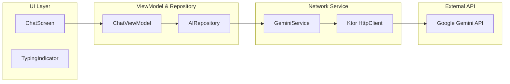

# Tugas Praktikum 9

**Nama : Exaudi Amin Hutasoit**

**NIM : 123140161**

**Kelas : PAM RA**

## Deskripsi

Aplikasi **Notes App** telah ditingkatkan pada Minggu 9 dengan integrasi **AI Assistant (Google Gemini)**. Aplikasi ini memungkinkan pengguna untuk berinteraksi dengan asisten pintar yang dapat membantu dalam mengelola catatan, memberikan ringkasan, atau menjawab pertanyaan produktivitas secara real-time.

## Arsitektur AI Integration

Integrasi AI menggunakan arsitektur berlapis untuk memastikan keamanan dan performa:



## Fitur Utama (Minggu 9)

1.  **Smart Chatbot Assistant**: Integrasi Google Gemini API (model `gemini-1.5-flash`) untuk asisten pintar di dalam aplikasi.
2.  **Multi-turn Conversation**: Asisten mampu mengingat konteks percakapan sebelumnya untuk memberikan respon yang lebih relevan.
3.  **System Prompt Engineering**: Implementasi instruksi sistem yang membuat AI berperan khusus sebagai asisten aplikasi catatan.
4.  **Graceful Error Handling & Retry**: Penanganan error jaringan yang informatif dilengkapi dengan tombol **Retry** untuk mencoba kembali permintaan yang gagal.
5.  **Secure API Management**: Penyimpanan API Key yang aman di `local.properties` dan diakses melalui `BuildConfig`, tidak diekspos di dalam kode sumber (Git).
6.  **Responsive UI**: Penggunaan `TypingIndicator` (animasi loading) dan `LazyColumn` yang mendukung pemuatan pesan secara dinamis.

## Cara Menjalankan

1. Pilih branch **week-9**.
2. Dapatkan API Key Gemini di [Google AI Studio](https://aistudio.google.com/).
3. Buka file `local.properties` di root proyek dan tambahkan:
   ```properties
   GEMINI_API_KEY=isi_api_key_anda
   ```
4. Jalankan aplikasi.
5. Klik ikon **AI Chat** (wajah) di pojok kanan atas layar utama untuk membuka asisten.

## Screenshot Aplikasi

| Chat Interface           | Typing Indicator | Error & Retry Logic |
|------------------------|---|---|
|  |  |  |

---
## Demo
[Link Video Demo Tugas 9]
