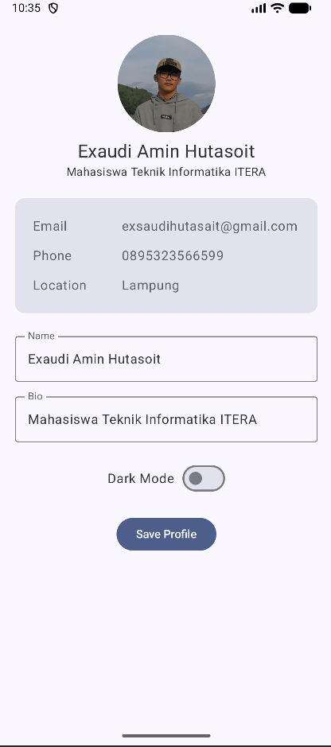
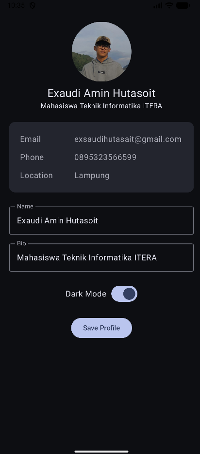
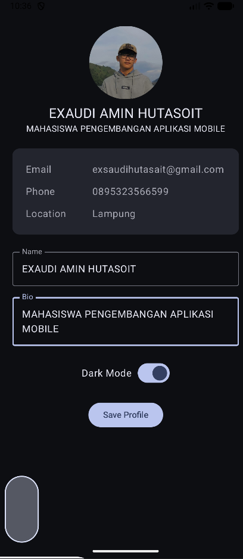

# Praktikum PAM M4 - My Profile App

## Deskripsi

Aplikasi ini dibuat menggunakan Jetpack Compose untuk menampilkan halaman profil serta fitur edit profil menggunakan arsitektur MVVM dan StateFlow.

## Fitur

* Menampilkan foto profil
* Menampilkan nama dan bio
* Informasi email
* Nomor telepon
* Lokasi
* Form edit profil (nama dan bio)
* Tombol Save untuk menyimpan perubahan
* Dark mode toggle

## Komponen Compose yang Digunakan

* Column
* Row
* Box
* Card
* Text
* Button
* Image
* OutlinedTextField
* Switch

## Screenshot Aplikasi

