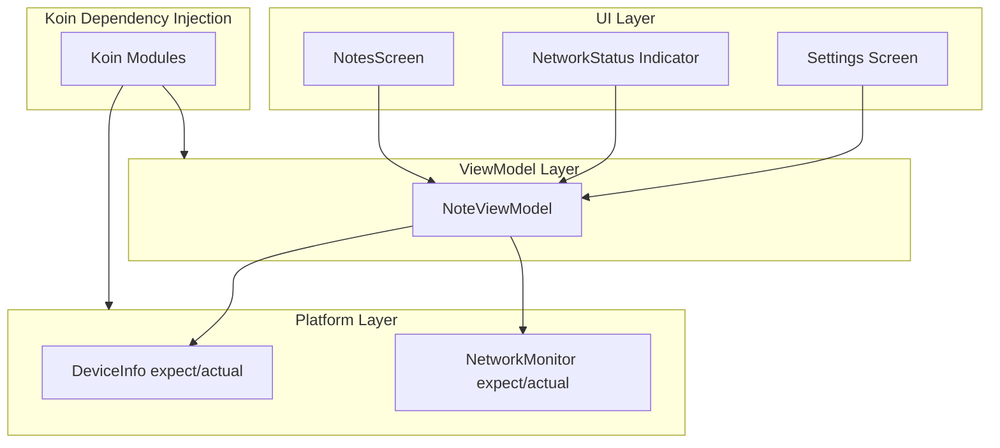
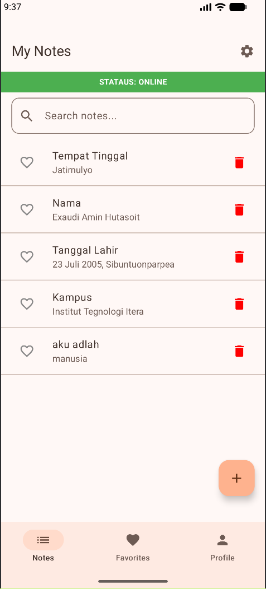
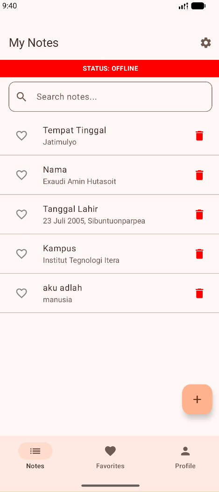
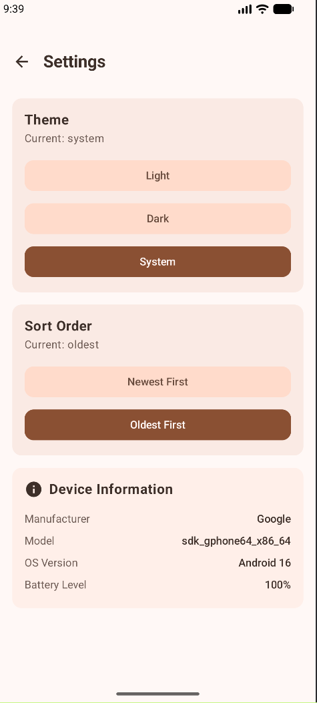

# Tugas Praktikum 8

**Nama : Exaudi Amin Hutasoit**

**NIM : 123140161**

**Kelas : PAM RB**

## Deskripsi

Aplikasi **Notes App** telah ditingkatkan pada Minggu 8 dengan fokus pada implementasi **Dependency Injection (Koin)** dan **Fitur Spesifik Platform** (Platform Specific Features). Aplikasi sekarang memiliki manajemen dependensi yang terpusat dan mampu mendeteksi informasi perangkat serta status jaringan secara real-time.

## Arsitektur Aplikasi

Aplikasi ini menggunakan arsitektur **MVVM** yang digabungkan dengan **Dependency Injection (Koin)** sesuai dengan skema berikut:

## Fitur Utama (Minggu 8)

1.  **Dependency Injection (Koin)**: Seluruh objek (Database, Repository, Settings, Platform Features, dan ViewModel) dibuat dan di-inject secara otomatis menggunakan Koin untuk meningkatkan efisiensi memori dan kebersihan kode.
2.  **Fitur Platform (expect/actual pattern)**: 
    *   Implementasi `DeviceInfo` untuk mengambil informasi teknis hardware Android.
    *   Implementasi `NetworkMonitor` untuk memantau koneksi internet.
3.  **Indikator Jaringan**: Banner status (ONLINE/OFFLINE) yang muncul di layar utama sesuai dengan kondisi internet perangkat.
4.  **Informasi Perangkat**: Bagian baru di menu Settings yang menampilkan Manufaktur, Model, Versi OS, dan Level Baterai perangkat.

## Cara Menjalankan

1. Pilih branch **week-8**.
2. Buka proyek di Android Studio.
3. Tunggu **Gradle Sync** hingga selesai.
4. Jalankan aplikasi pada emulator atau perangkat Android asli.
5. Untuk mengetes status jaringan, aktifkan dan nonaktifkan **Mode Pesawat**.

## Screenshot Aplikasi

| Network ONLINE         | Network OFFLINE | Device Information |
|------------------------|---|---|
| ) |  |  |

---
## Demo
https://youtu.be/oLEFv34zwN8 
